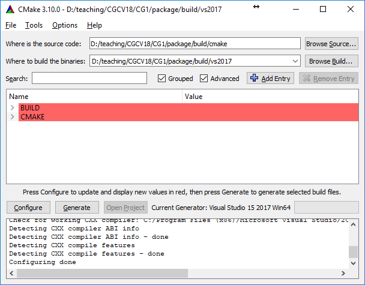

Here lies the framework provided for the second part of the 2024 course ["Computer Graphics"](https://online.tugraz.at/tug_online/ee/ui/ca2/app/desktop/#/slc.tm.cp/student/courses/402641?$scrollTo=toc_overview) [1] at [Graz University of Technology](https://www.tugraz.at/home/) [2].


## Automatic Testing Pipeline / (Final) Submission

**The assignments.icg.tugraz.at automatically runs your code in a testing pipeline as soon as you push to the remote repository.
There you can view build logs, output logs and rendered images in the CI/CD section of the gitlab webinterface.**

For submission you must create a `submission` branch and push your code into this branch.
We will only grade solutions that have been pushed to the `submission` branch of your repository! To
build the framework, please follow the build instructions down below.

## Git Basics / Creating the `submission` Branch

The following commands add the local change (of a file) in the working directory to so-called staging area and 
create a commit:

```bash
git add <path_to_algorithms.cpp>
git commit -m "I did this and that and enter info about it here here"
```

To push this commit to the server (and make the changes visible in the web interface), you need to `git push`:

```bash
git push origin <branch_name>
```

To create the `submission` branch (and thus make a submission, which will also be evaluated by the automatic test system for your feedback), you can use the following commands from within the root directory of this repository:

```bash
git checkout -b submission
git push origin submission
```

The first command creates a new `submission` branch, and the second command pushes this branch onto the remote repository.


## Building and running the assignment framework

To build the framework, the following tools are needed

  * a C++ toolchain with C++17 support (e.g. GCC 8.x+, Visual Studio 2017+ )
  * [CMake 3.10+](https://cmake.org/) [5]
  * OpenGL 3.3

CMake scripts to generate a build system can be found in `build/cmake`. Compiled applications will be placed in a subdirectory `./bin/` within the CMake binary directory. We have tested the environment on the following systems:

* Docker on Ubuntu, Windows
* Ubuntu 20.04 and 22.04
* (NO ACTIVE SUPPORT) Windows 10 with Build Tools (2017, 2019)

We offer multiple ways to build and run the framework, which are described below.
The recommended configurations are VS Code (with or without Dev Containter) for Linux, and a native install for Windows, but other configurations work as well.

Whichever development environment you chose, keep in mind that your results on our servers (in your `submission` branch) will be used for grading.

## VS Code

If you are on Linux and using VS Code and have installed the necessary dependencies (see Ubuntu Native section), you can just press `F5` or go to `Run and Debug` and press `Launch Single Test` when you have opened your repository with it. VS Code should automatically create the build folders, build your code and execute a test of your choice within a debug environment. 

Additionally, `Launch App` will start the gui, with which you can manually set the transfer function and choose config files to load.

There are also scripts provided in `./scripts`, which let you run all tests and create diffs for them.


## Using VS Code with Dev Container

We also provide you with a prebuild Dev Container environment. You just have to install VS Code and the extension Dev Containers (`ms-vscode-remote.remote-containers`) and execute the command `Open Folder in Container...`


The image will now build and install the C++-extension automatically. You should be able to just run and edit your code just like instructed above.

If you are on Windows 10/11, you have to follow [this guide](https://code.visualstudio.com/blogs/2020/07/01/containers-wsl), where the main difference is that you have to start VS Code from the command line **within** WSL2 using `code .` from your checked out repository.

## Docker Image (replacement for a VM)

You can also run everything from the command line within a Docker image. For this, you have to build and tag the image first (these commands only work on Linux and WSL, both x86 and aarch64, for Windows see below):

```bash
docker build -t cg2-runner .
```
>Note:  you only have to build the docker image once

Then you can start the container and mount your local directory using the following command, which will build and run a test: 
```bash
docker run --init -v "$PWD":/cg2 -it cg2-runner ./scripts/single_test.sh
```


You can also run all tests via the provided script `./scripts/run_all_tests.sh`, which will create diffs for all testcases.

>Note: You might need to run the commands in root, if you have troubles with permissions

### Experimental 

We do not offer active support the gui in Docker. The assignment can be completed without issues without the gui. However if you would still like to try it, you can use the following command on Linux using Docker instead:

```bash
docker run --init  --net=host -e DISPLAY=$DISPLAY --volume="$HOME/.Xauthority:/root/.Xauthority:rw" --device=/dev/dri:/dev/dri  -v "$PWD":/cg2 -it cg2-runner ./scripts/gui.sh
```

This should allow us to use the Linux host display in Docker - note that on some systems, [the following fix](https://stackoverflow.com/questions/48833451/no-protocol-specified-when-running-a-sudo-su-app-on-ubuntu-linux) might resolve issues due to Authorization.

Sadly this command won't work readily for Docker in Windows WSL.

## Ubuntu Native (20.04 and up)

You will need a working `cmake` and `gcc` (11 and up) installation, as well as OpenGL 3.3. We additionally recommend `gdb` for a working VSCode Debug setup, all of which you can get on Ubuntu (and Ubuntu within WSL2) using the command:
```bash
sudo apt-get install cmake gdb g++-11 gcc-11 libgl1-mesa-dev 
```
> Note: you may need to run `sudo apt-get update` first if you have a fresh Ubuntu install!

This should already allow you to use VS Code to build and execute your code (see VS Code section).


The current compilers shipping with Ubuntu 20.04 and up (if installed using `build-essential` or `gcc`)  are sufficient for this exercise. If you have an older version, please install *and switch* using `update-alternative` to the newer version:
```bash
sudo apt-get install gcc-11 g++-11
```

On older versions of Ubuntu (e.g. Ubuntu 16.04), g++ 8.x is not available from default distribution repositories. You may be able to get a working build from other sources such as, e.g., the [`ubuntu-toolchain-r/test`](https://launchpad.net/~ubuntu-toolchain-r/+archive/ubuntu/test) [6] repository:

```bash
sudo add-apt-repository ppa:ubuntu-toolchain-r/test
sudo apt-get update
sudo apt-get install gcc-8 g++-8 libgl1-mesa-dev
```

Assuming you have installed [CMake 3.10](https://cmake.org/) [5] or newer as well as a suitable C++ toolchain, a build system can then be generated. First, switch into the directory where you want to the build files to be placed, for example:

```bash
cd /path/to/repository
cd build
mkdir bin
cd bin
```

Then, call `cmake` to generate the build system:

```bash
cmake ../cmake/
```

The path to the `build/cmake` directory containing the CMake scripts (here `../cmake/`) has to be passed as the last argument to the `cmake` command.

> Instead of using the commandline, you can install the `cmake-qt-gui` package to get a GUI application for managing the CMake generation process in essentially the same way as described in the Windows setup guide above. Use the "Specify native compilers" option in the generator selection dialogue to change the set of compilers to be used.

Once the build files have been generated, the project can be compiled using

```bash
make task2
```

## Windows Native

For working on Windows, the framework was tested on the [Visual Studio](https://www.visualstudio.com/) 2017, 2019 and 2022 [3] IDE (Community Edition is sufficient). Note that the framework requires Version 15.5 and up.

Open the [CMake GUI application](https://cmake.org/) and point the CMake source path to the location of your `build/cmake` directory. Set the second path to point to the location where you would like your Visual Studio project files to be placed, e.g., `build/vs2017`.


Press [Configure] and select the appropriate Visual Studio generator


At this point, you can optionally edit the configuration and afterwards press [Generate].



Finally, open the generated Visual Studio solution that should now be found in the build directory specified earlier. Do not forget to set the correct startup project (in our case 'task2'):


To set up the working directory and commandline arguments for launching your application from within the Visual Studio debugger, go to Project Properties > Debugging:


## Differences to Reference Solution

Starting a single test via the commandline or via VS Code, or running all tests via ``./scripts/run_all_tests.sh`` will also compare your output to the reference solution and generate difference files in ``/output/diffs``. 

We also include an additional script ``./scripts/pixel_diff_count.sh`` that will tell you the exact amount of pixels that differ from the reference solution.


## Application GUI

The framework offers a gui for manual viewing of volumes and setting of transfer functions. 

The gui is only supported on native installs, for Docker we only offer an experimental fix for Docker running under Linux (see Docker section).

The gui consists of 5 different windows; you can see the whole gui here:


The application can be started with the following command-line options:

- `--configfile <PATH>` Load a configuration file based on `PATH`.

- `--numthreads <N>` Volume rendering with `N` threads.

- `--output <PATH>` Write diff files based on `PATH`.

- `--width <N>` Width `N` of the volume rendering image in pixels.

- `--height <N>` Height `N` of the volume rendering image in pixels.

The gui will only start if there is not `output` option.
With the `output` option included (which is what the test scripts do), the application will terminate after creating the following output files:


- `<output>-rendering.png`: Contains the generated output image with dimensions `width` and `height`.
- `<output>-lookup.png`: Lookup table with interpolated intermediate values.
- `<output>-lut.png`: Lookup table.

- `<output>-slice-x.png`: Density value slice of the volume along the X-axis.
- `<output>-slice-y.png`: Density value slice of the volume along the Y-axis.
- `<output>-slice-z.png`: Density value slice of the volume along the Z-axis.
- `<output>-aabb-near.png`: AABB distance to near intersection point.
- `<output>-aabb-far.png`: AABB distance to far intersection point.


### Windows

Here we will describe the different windows of the gui.

#### Settings

In this window you can adjust general settings.


-  **Background**: Background color of the rendering

-  **Step size**: Sampling interval of the ray

-  **Alpha threshold**: Threshold $\alpha_{thres}$ for Early-Ray-Termination

-  **Opacity correction**: Global scaling factor for the opacities of the transfer function

-  **Render**: Toggle volume raycasting on/off

-  **Shading**: Toggle the lighting model on/off

-  **Save Config**: Creates a JSON file (\textit{saved\_config.json}) in the current working directory containing all current settings


#### Transfer Function

This window allos for the free parameterization of the transfer function.


- **Restrict to max iso-value**: Limits the \textbf{Iso-value} axis (density) to the maximum density value of the loaded volume.

- **Generate Transfer Function**: If the \textbf{Auto Update} function is disabled, this triggers the creation of the lookup table.

- **New**: Adds a new control point set.

- **Delete**: Deletes the selected control point set.

- **Auto Update**: Automatically updates the lookup table after any changes.

- **Color**: Color selection for the selected control point set.


The graph displays the control point sets of the transfer function. Each set is represented by the color assigned to it.
Below the graph is a color bar that represents the resulting colors based on the control point sets.

After adding a new control point set, a square appears that corresponds to the color of the set.
A control point set can be selected by clicking on the respective square.
You can change the color of the set using the **Color** selection.
The control points themselves can be moved arbitrarily for the currently selected set using drag-and-drop.
New control points are added by left-clicking the mouse at the desired position on the graph.
To delete a control point, position the mouse over the control point and right-click.

#### Datasets

Over the dropdown menu, various volume datasets can be loaded. 
This resets the transfer function settings.


#### Shading Parameters

In this window you can adjust settings for the Phong lighting model.


- **k\_ambient**: ambient reflection coefficient
- **k\_diffuse**: diffuse reflection coefficient
- **k\_specular**: specular reflection coefficient
- **shininess**: specular exponent
- **light color**: light color


#### Volume Rendering

This window displays the generated image from the Volume Raycasting algorithm.
By holding the left mouse button within the window, you can move the camera.
You can zoom by clicking the mouse wheel or holding down the right mouse button.


[1] https://online.tugraz.at/tug_online/ee/ui/ca2/app/desktop/#/slc.tm.cp/student/courses/402641?$scrollTo=toc_overview
[2] https://www.tugraz.at/home/
[3] https://www.visualstudio.com/
[4] https://cmake.org/
[5] https://launchpad.net/~ubuntu-toolchain-r/+archive/ubuntu/test
